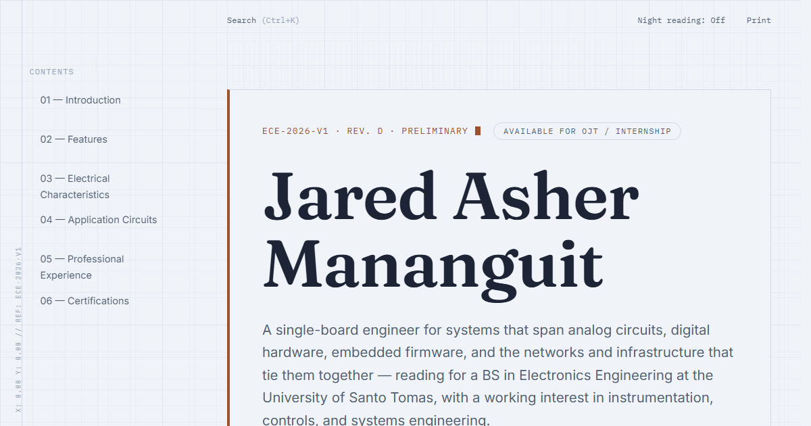

# Jared Asher Mananguit — Engineering Portfolio

> A systems and electronics engineering portfolio, built to read like an official engineering datasheet rather than a typical résumé site.



## Overview

This is the personal engineering portfolio of **Jared Asher Mananguit**, a BS Electronics Engineering student at the University of Santo Tomas. Instead of a conventional portfolio layout, the site is designed to feel like a technical datasheet or IEEE-style application note — projects are documented as numbered "Application Notes" (AN-001 … AN-005) with executive summaries, specs, and lessons learned.

The site is a **dependency-free static site**: semantic HTML5, modular hand-written CSS, and vanilla ES modules. There is no framework, no backend, no database, and no build step required to run it.

## Features

- Single-page "datasheet" layout with a bookmark rail and mobile table of contents
- Client-side command-palette search (`Ctrl+K`)
- Light / dark ("night reading") theme, persisted in `localStorage`
- Scroll-triggered reveal animations and a live telemetry/clock strip
- Dedicated print stylesheet for generating a clean PDF straight from the browser
- Five in-depth Application Note pages under [`projects/`](projects/)
- Certificates and résumé served as linked PDFs

## Tech Stack

| Layer | Technology |
| :--- | :--- |
| Markup | Semantic HTML5 |
| Styling | Modular CSS3 (ITCSS-inspired: tokens → base → layout → components → utilities → motion → print) |
| Behavior | Vanilla JavaScript (ES modules), no framework |
| Fonts | Self-hosted `woff2` — Fraunces, Inter, IBM Plex Mono |
| Tooling | Node.js scripts for linting, link-checking, and packaging a `dist/` build (no bundler needed) |

## Project Structure

```text
(repo root)
├── index.html              # Main portfolio document
├── css/                     # tokens, base, layout, components, utilities, motion, print
├── js/                      # theme, nav, search, reveal, engineering-fx, main
├── projects/                # AN-00x Application Note pages
├── assets/                  # fonts/, certificates/
├── Jared_Mananguit_Resume.pdf
├── scripts/                 # build.mjs, check-links.mjs
├── docs/                    # extended design & technical documentation
└── CV/                      # source material not published on the site
    ├── READ/ProjectCV.md    # original design brief
    ├── Resume/, Certificates/ # source copies of published PDFs
    └── Projects/             # raw coursework PDFs (content backlog for future Application Notes)
```

## Environment Variables

**None.** This is a static site with no backend, so no `.env` file or secrets are required to run it locally or in production.

## Local Development

**Prerequisites:** Python 3 (for the simplest static server) or Node.js 18+ (for the lint/test/dev scripts).

```bash
# Option A — zero dependencies
python -m http.server 8080
# then open http://localhost:8080

# Option B — via npm scripts (installs no framework, just dev tooling)
npm install
npm run dev     # serves the site on http://localhost:3000
npm run lint    # HTML + CSS linting
npm run test    # verifies every local href/src resolves to a real file
npm run build   # assembles a deployable copy in dist/
```

## Deployment

Because the site has no server-side dependencies, it deploys as static files to any static host (GitHub Pages, Netlify, Vercel, S3, etc.):

1. `npm run build` — produces a clean, deployable copy in `dist/`
2. Upload/point your static host at the contents of `dist/`

## Architecture

See [`docs/DOCUMENTATION.md`](docs/DOCUMENTATION.md) and [`docs/TECHNICAL_DOCUMENTATION.md`](docs/TECHNICAL_DOCUMENTATION.md) for the full design system, CSS architecture, and component breakdown.

## Contributing

See [`CONTRIBUTING.md`](CONTRIBUTING.md).

## License

The code (HTML/CSS/JS) is licensed under [MIT](LICENSE). Personal content — résumé, certificates, project write-ups, and biographical text — is not covered by this license and should not be reused without permission.

## Author

**Jared Asher Mananguit** — BS Electronics Engineering (ECE), University of Santo Tomas
[jaredasher.mananguit.eng@ust.edu.ph](mailto:jaredasher.mananguit.eng@ust.edu.ph)
