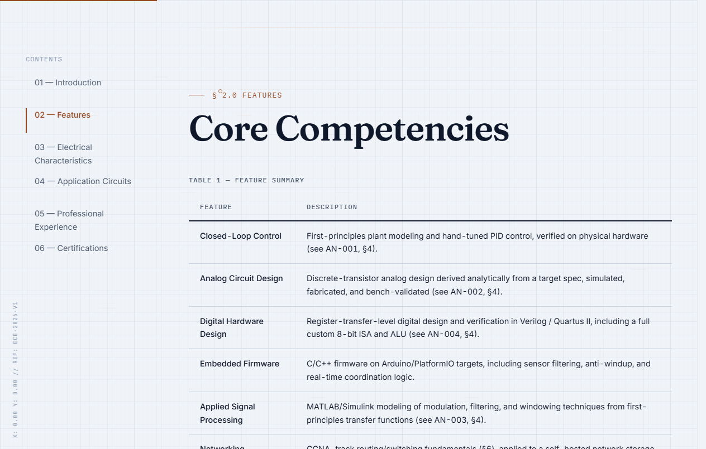
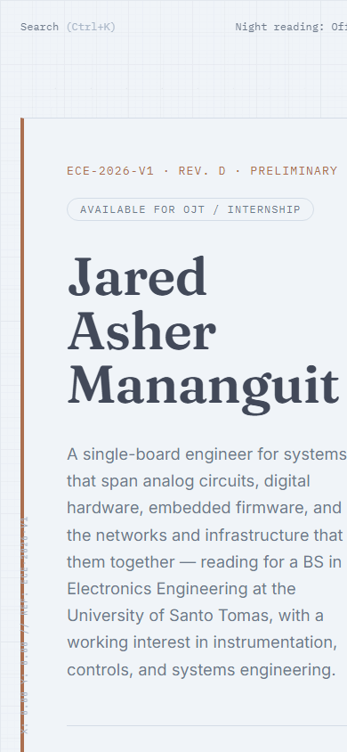
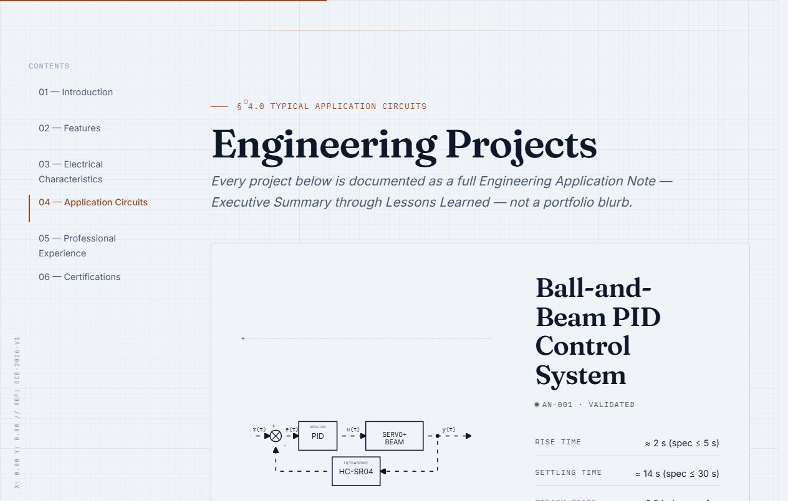

# Jared Asher Mananguit — Engineering Portfolio

> A systems and electronics engineering portfolio, built to read like an official engineering datasheet rather than a conventional résumé site.

[](LICENSE)


## Table of Contents

- [Overview](#overview)
- [Design Philosophy](#design-philosophy)
- [Key Features](#key-features)
- [Screenshots](#screenshots)
- [Project Architecture](#project-architecture)
- [Technology Stack](#technology-stack)
- [Engineering Illustrations](#engineering-illustrations)
- [AI-Assisted Development](#ai-assisted-development)
- [Installation](#installation)
- [Development](#development)
- [Build Process](#build-process)
- [Deployment](#deployment)
- [Quality Assurance](#quality-assurance)
- [Future Improvements](#future-improvements)
- [Contributing](#contributing)
- [Author](#author)
- [License](#license)

---

## Overview

This is the personal engineering portfolio of **Jared Asher Mananguit**, a BS Electronics Engineering student at the University of Santo Tomas.

Most portfolio sites are built as marketing pages — a hero photo, a skills cloud, a grid of project thumbnails. This one is built as a **technical publication instead**: content is organized like an IEEE-style application note, with an executive summary, specifications, and lessons learned for each project (`AN-001` … `AN-005`), and the site itself is versioned and revision-stamped like a datasheet (`ECE-2026-V1 · Rev. D`).

The reasoning is simple: for hardware, firmware, and systems engineering work, a screenshot and a one-line caption don't communicate competence — the reasoning behind a design does. This format is aimed at **engineering managers, technical recruiters, and peers** who want to evaluate how someone thinks, not just what they built.

Structurally, the site is a **dependency-free static site**: semantic HTML5, modular hand-written CSS, and vanilla ES modules. No framework, no backend, no database, and no build step is required to run it locally.

## Design Philosophy

The visual and structural decisions below are deliberate, not incidental — each one is in service of the "engineering publication" framing rather than a conventional portfolio look.

**Engineering-publication aesthetic.** The layout borrows directly from Texas Instruments / Analog Devices application notes and IEEE papers: a document control header, numbered sections (`§1.0`, `§2.0`, …), a sidebar bookmark rail instead of a nav bar, and a "PRELIMINARY / Rev. D" status stamp. The test applied to every design decision was: *would this be believable inside official documentation from TI, Analog Devices, Keysight, or IEEE?*

**Typography as information hierarchy.** Three typefaces do three distinct jobs: *Fraunces* (serif) for headings gives an editorial, authoritative register; *Inter* for body copy keeps long technical passages legible at high density; *IBM Plex Mono* is reserved for anything that reads as data — signal names, telemetry, spec tables — so the reader can distinguish narrative from measurement at a glance.

**Modular, ITCSS-inspired CSS.** Styles are layered by responsibility (`tokens` → `base` → `layout` → `components` → `utilities` → `motion` → `print`) rather than per-component files. This keeps global changes (a color, a spacing scale) safe to make in one place, and keeps component-level styling from leaking into layout concerns.

**Responsive by necessity, not as an afterthought.** The two-column "bookmark rail + reading column" layout only makes sense above ~1024px; below that, the rail collapses into a `<details>`-based mobile table of contents so the reading column can use the full viewport width. Every breakpoint decision was driven by content legibility, not device categories.

**Accessibility as a design constraint, not a checklist.** Motion is opt-out by default (`prefers-reduced-motion` disables scroll-reveal and background animation without hiding content), all interactive elements meet minimum touch targets, and both themes are contrast-checked against WCAG AA — because a document that isn't accessible fails the "professional documentation" bar it's trying to hit.

**Visual hierarchy over decoration.** There are no drop shadows, gradients, or card-hover lift effects competing for attention. Hierarchy comes from type scale, rule weight, and whitespace — the same tools a real datasheet uses.

## Key Features

- **Single-page datasheet layout with a bookmark rail** — Long-form technical documents need a persistent "where am I" anchor. The sidebar rail (collapsing to a mobile `<details>` ToC) lets a reader jump between sections without losing their place, the way a PDF outline does.
- **Client-side command-palette search (`Ctrl+K`)** — Recruiters skim. A keyboard-driven search overlay lets them jump straight to "AN-004" or "CCNA" instead of scrolling through six sections.
- **Light / dark "night reading" mode** — Persisted in `localStorage` and contrast-checked in both directions, not just inverted colors. Exists because engineers reading documentation at night shouldn't have to fight a stark white background.
- **Scroll-triggered reveal + telemetry strip** — Subtle, `prefers-reduced-motion`-aware section reveals and a live clock/status strip reinforce the "active system" feel without becoming distracting animation.
- **Dedicated print stylesheet** — Strips all screen-only chrome (rail, search, utility bar) and applies clean page breaks, so "Print" in the browser produces a usable PDF instead of a broken screenshot.
- **Five in-depth Application Note pages** — Each project under [`projects/`](projects/) is a full write-up (problem statement → design → validation → lessons learned), not a portfolio blurb.
- **Certificates and résumé as linked PDFs** — Credentials open natively in-browser rather than forcing a download, matching how a real technical document would cite supporting material.

## Screenshots

<table>
<tr>
<td width="50%">

**Desktop — Core Competencies**


</td>
<td width="50%">

**Mobile View**


</td>
</tr>
<tr>
<td width="50%">

**Engineering Illustrations** (AN-004, SAP-2 Architecture)


</td>
<td width="50%">

**Application Circuits (Projects)**


</td>
</tr>
</table>

**Certifications**


## Project Architecture

```text
(repo root)
├── index.html              # Main portfolio document
├── css/                     # tokens, base, layout, components, utilities, motion, print
├── js/                      # theme, nav, search, reveal, engineering-fx, main
├── projects/                # AN-00x Application Note pages
├── assets/                  # fonts/, certificates/
├── Jared_Mananguit_Resume.pdf
├── scripts/                 # build.mjs, check-links.mjs
├── docs/                    # extended design & technical documentation, screenshots
└── CV/                      # source material not published on the site
    ├── READ/ProjectCV.md    # original design brief
    ├── Resume/, Certificates/ # source copies of published PDFs
    └── Projects/             # raw coursework PDFs (content backlog for future Application Notes)
```

Each top-level directory has exactly one responsibility: `css/` never contains markup logic, `js/` never contains styling, and `projects/` never contains anything that isn't a self-contained Application Note. This separation is what makes it possible to add a sixth project or a new section without touching unrelated files — the same reasoning that motivates the CSS layering described in [Design Philosophy](#design-philosophy).

`CV/` is deliberately kept outside the published surface: it holds the original design brief and raw source material (coursework PDFs, original certificate/résumé files) that either predate the site or haven't been turned into Application Notes yet. Nothing under `CV/` is linked from `index.html`.

## Technology Stack

| Technology | Purpose | Reason for Selection |
| :--- | :--- | :--- |
| **Semantic HTML5** | Document structure and content | Native accessibility semantics (landmarks, headings) with zero abstraction cost — appropriate for a page that's meant to look and behave like a document. |
| **Modular CSS3** (ITCSS-inspired) | Visual design system | Full control over the exact "datasheet" aesthetic without fighting a utility framework's defaults; layered files keep large stylesheets maintainable without tooling. |
| **Vanilla JavaScript** (ES modules) | Progressive enhancement (search, theme, reveal, nav) | The interactive surface is small and well-defined enough that a framework would add bundle size and complexity without a corresponding benefit. |
| **Self-hosted `woff2` fonts** | Typography (Fraunces, Inter, IBM Plex Mono) | Avoids third-party font-host requests (privacy, performance, no render-blocking external DNS lookups) and guarantees the exact typographic pairing the design depends on. |
| **Node.js + npm scripts** | Dev server, linting, link-checking, build packaging | Enough tooling to catch real mistakes (broken links, invalid HTML/CSS) without requiring a bundler the site doesn't need. |
| **htmlhint / stylelint** | Static analysis | Catches structural HTML errors and CSS mistakes (e.g. duplicate selectors, invalid rules) before they ship — cheap insurance for hand-written markup and styles. |
| **GitHub Actions** | CI (lint, build, test) | Runs the same checks on every push/PR that a contributor is expected to run locally, so regressions are caught before merge rather than after deploy. |

## Engineering Illustrations

Every block diagram, circuit topology, and network architecture drawing on the site is an **inline SVG**, not a raster image — and that choice is central to the "datasheet" premise rather than incidental.

- **Theme-aware by construction.** Strokes use `currentColor`, so every diagram automatically inverts between light and dark ("night reading") mode with no duplicate dark-mode asset to maintain.
- **Typography-consistent.** Labels inside diagrams inherit the page's own font stack, so a signal name in a figure and a signal name in body text render identically — no "pasted image" seam.
- **Scale-stable.** `vector-effect="non-scaling-stroke"` keeps line weight constant as diagrams shrink for mobile, preventing the thin schematic lines from either disappearing or blowing out.
- **Interactive by nature.** Because the diagrams are real DOM nodes, CSS can animate them directly (e.g. the signal-flow trace animation in `css/motion.css`) — something a flattened image could never do.

## AI-Assisted Development

This project's history includes AI assistance at two distinct points, and it's worth being specific about what that meant in practice rather than leaving it vague.

**Original build (Google AI Studio / Gemini).** The initial implementation — HTML structure, CSS design system, and content — was built with AI assistance for architecture inspection, implementation planning, and iterative refactoring (e.g. standardizing SVG stroke widths, tuning the typographic scale). All aesthetic direction and content came from the author; AI was directed with explicit constraints ("no SaaS/Tailwind/Framer aesthetics") and used to accelerate implementation of decisions that were already made.

**Migration and hardening (Claude Code).** The project was later migrated out of AI Studio into this standalone repository, which involved removing an unused scaffold left over from the original template, fixing several latent bugs the migration surfaced (broken asset paths, a CSS rule conflict that had silently disabled a `prefers-reduced-motion` accessibility guarantee), and adding the tooling described in [Quality Assurance](#quality-assurance) below.

In both cases, AI functioned as an engineering assistant — used for analysis, drafting, and QA support — with a developer reviewing, testing, and directing every change. See [`CHANGELOG.md`](CHANGELOG.md) for the specific, dated record of what changed and why.

## Installation

**Prerequisites:** Python 3 (for the simplest static server) or Node.js 18+ (for the lint/test/dev/build scripts).

```bash
git clone https://github.com/Jrddlol2/jared-mananguit-engineering-portfolio.git
cd jared-mananguit-engineering-portfolio
npm install   # only needed if you want lint/test/dev/build scripts
```

> [!NOTE]
> **No environment variables required.** This is a static site with no backend — there's no `.env` file or secret to configure to run it locally or in production.

## Development

```bash
# Option A — zero dependencies
python -m http.server 8080
# then open http://localhost:8080

# Option B — via npm scripts
npm run dev     # serves the site on http://localhost:3000
npm run lint    # HTML + CSS linting
npm run test    # verifies every local href/src resolves to a real file
```

## Build Process

```bash
npm run build   # assembles a deployable copy in dist/
```

There is no bundling, transpilation, or minification step — the source files are already what ships. `npm run build` exists purely to assemble a clean `dist/` folder (excluding source-only files like `CV/` and `docs/`) that's safe to point a static host at.

## Deployment

Because the site has no server-side dependencies, it deploys as static files to any static host (GitHub Pages, Netlify, Vercel, S3, etc.):

1. `npm run build` — produces a clean, deployable copy in `dist/`
2. Upload/point your static host at the contents of `dist/`

## Quality Assurance

- **Automated link checking** (`npm run test`) — verifies every local `href`/`src` in the site resolves to a real file; runs in CI on every push and PR.
- **Static analysis** (`npm run lint`) — HTML validity (`htmlhint`) and CSS correctness (`stylelint`), tuned to catch real defects (duplicate selectors, broken rules) without fighting the project's intentional hand-written style.
- **Visual consistency** — typography rhythm, spacing, and color contrast reviewed across both light and dark themes.
- **Responsive testing** — layout verified from 320px mobile through ultrawide desktop, including the bookmark-rail → mobile-ToC collapse.
- **Accessibility** — keyboard navigation, focus states, and `prefers-reduced-motion` behavior checked directly (not just assumed from markup).
- **Print fidelity** — `print.css` output checked to confirm navigation chrome is stripped and page breaks land cleanly.

<details>
<summary>Full technical documentation and design rationale</summary>

For a deeper, narrative account of the original design process, methodology, and challenges encountered, see [`docs/DOCUMENTATION.md`](docs/DOCUMENTATION.md) and [`docs/TECHNICAL_DOCUMENTATION.md`](docs/TECHNICAL_DOCUMENTATION.md). These documents predate the AI Studio → standalone-repo migration and describe the original build in detail; this README is the current source of truth for setup, tooling, and architecture.

</details>

## Future Improvements

- **Content backlog** — Seven raw coursework reports currently sit in `CV/Projects/` unpublished; `AN-005` (self-hosted network storage) is already scaffolded on the site and marked "in development."
- **Interactive diagrams** — Hover states on SVG diagram nodes to reveal detailed technical tooltips (spec values, part numbers) without leaving the page.
- **Internationalization** — Multi-language support for a broader audience, if warranted.
- **Automated résumé generation** — Generate `Jared_Mananguit_Resume.pdf` directly from the live HTML content as part of the build step, so the two can't drift out of sync.

## Contributing

External content contributions (résumé, project write-ups, biography) aren't accepted, but code fixes — accessibility, broken links, CSS/JS bugs, tooling — are welcome. See [`CONTRIBUTING.md`](CONTRIBUTING.md) for setup and the required checks before opening a PR.

## Author

**Jared Asher Mananguit** — BS Electronics Engineering (ECE), University of Santo Tomas
[jaredasher.mananguit.eng@ust.edu.ph](mailto:jaredasher.mananguit.eng@ust.edu.ph) · [GitHub @Jrddlol2](https://github.com/Jrddlol2)

## License

The code (HTML/CSS/JS) is licensed under [MIT](LICENSE). Personal content — résumé, certificates, project write-ups, and biographical text — is not covered by this license and should not be reused without permission.
