# Jared Asher Mananguit — Engineering Portfolio (V2)

> An engineering portfolio built and read like a technical publication, not a résumé site.

[](https://github.com/Jrddlol2/jared-mananguit-engineering-portfolio-v2/actions/workflows/ci.yml)
[](https://github.com/Jrddlol2/jared-mananguit-engineering-portfolio-v2/actions/workflows/deploy.yml)
[](LICENSE)


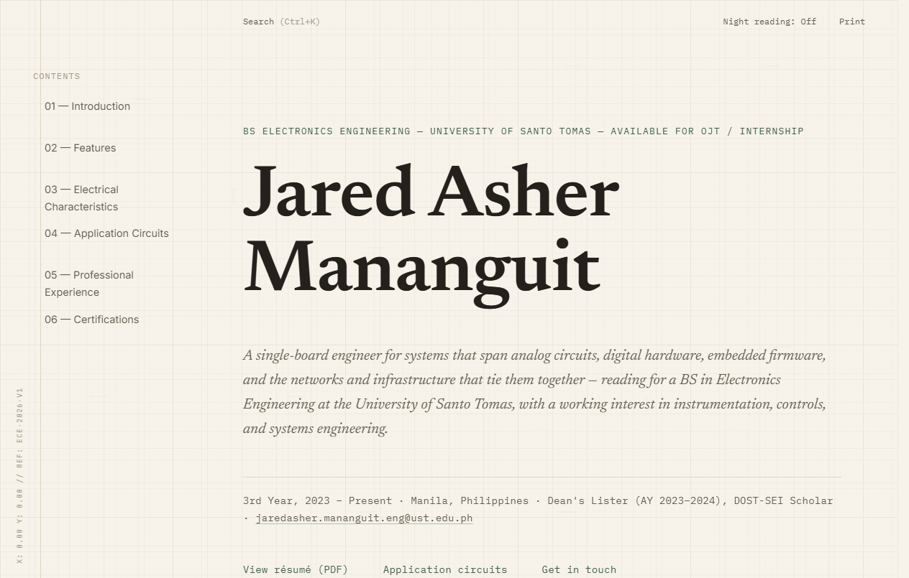

## Table of Contents

- [Overview](#overview)
- [Status: this is V2, in progress](#status-this-is-v2-in-progress)
- [Features](#features)
- [Screenshots](#screenshots)
- [Responsive Design](#responsive-design)
- [Project Structure](#project-structure)
- [Technologies](#technologies)
- [Design Philosophy](#design-philosophy)
- [AI-Assisted Development](#ai-assisted-development)
- [Local Development](#local-development)
- [End-to-End Testing](#end-to-end-testing)
- [Deployment](#deployment)
- [Future Improvements](#future-improvements)
- [Author](#author)
- [License](#license)

---

## Overview

This is the personal engineering portfolio of **Jared Asher Mananguit**, a BS Electronics Engineering student at the University of Santo Tomas.

The site is built on a simple premise: a screenshot and a one-line caption don't communicate engineering competence — the reasoning behind a design does. So instead of a conventional portfolio layout (hero photo, skills cloud, project thumbnails), content is organized like a technical publication: each project is a full case study — problem, objectives, design decisions, validation, lessons learned — not a portfolio blurb.

**Intended audience:** engineering managers, technical recruiters, and peers evaluating how someone thinks, not just what they built.

The site is a **dependency-free static site** — semantic HTML5, modular hand-written CSS, and vanilla ES modules. No framework, no backend, no database, no build step required to run it.

## Status: this is V2, in progress

This repository is a deliberate fork of [`jared-mananguit-engineering-portfolio`](https://github.com/Jrddlol2/jared-mananguit-engineering-portfolio) (V1 — a stable, complete "engineering datasheet" styled site), created to host a ground-up editorial redesign without touching or risking the original.

**Redesigned so far:** the color system, typography, and the homepage hero.
**Not yet redesigned:** everything below the hero (Features, Characteristics, Projects, Experience, Certifications) still uses V1's document/datasheet structure — it automatically inherited the new color palette and typography (both are set via shared CSS custom properties), but its layout hasn't been rebuilt yet.

This README, the documentation in [`docs/`](docs/), the CI pipeline, the GitHub Pages deployment, and the Playwright test suite all describe and verify the site **as it exists right now** — a valid, tested, deployable state — not a finished vision of the full redesign.

## Features

- **Engineering-documentation-inspired UI** — numbered sections (`§1.0`, `§2.0`, …), a sidebar bookmark rail instead of a nav bar, and document-control metadata, borrowed from IEEE papers and semiconductor application notes rather than conventional portfolio templates.
- **Responsive design** — a two-column bookmark-rail-and-reading-column layout above ~1080px that collapses to a single column with a `<details>`-based mobile table of contents below it; verified from 320px through ultrawide.
- **Engineering illustrations** — every diagram (block diagrams, control loops, CPU architecture, network topology) is a hand-authored inline SVG, not a raster image or embedded drawing tool export.
- **Technical project pages** — five in-depth Application Note pages under [`projects/`](projects/), each a self-contained case study with its own local masthead, table of contents, and section-by-section write-up.
- **Certificate management** — certifications are listed with issuer, status, and year, linking directly to the real PDF, opened in a new tab rather than forced to download.
- **Dark mode** ("night reading") — persisted per-browser via `localStorage`, respects the OS `prefers-color-scheme` on first visit, and is contrast-checked independently rather than just inverted.
- **Command palette search** (`Ctrl+K` / `Cmd+K`) — a keyboard-driven overlay indexing every section, project, and named technology, with arrow-key navigation and `Enter` to jump.
- **Responsive SVG diagrams** — `vector-effect="non-scaling-stroke"` keeps line weight constant as diagrams shrink, and `currentColor` strokes mean every diagram inverts automatically between themes with no duplicate dark-mode asset.
- **Accessibility considerations** — a working skip link (with a focusable target — see [Design Philosophy](#design-philosophy)), correct heading hierarchy, `prefers-reduced-motion` support throughout, and automated `axe-core` scans in the test suite.

## Screenshots

<table>
<tr>
<td width="50%">

**Hero**
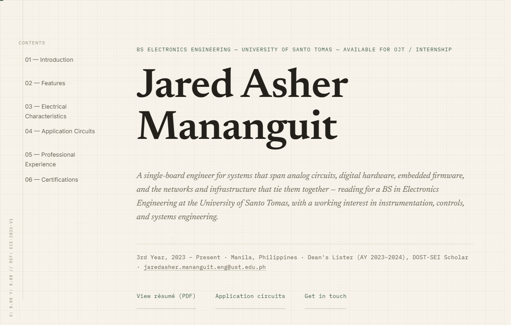

</td>
<td width="50%">

**Dark mode**
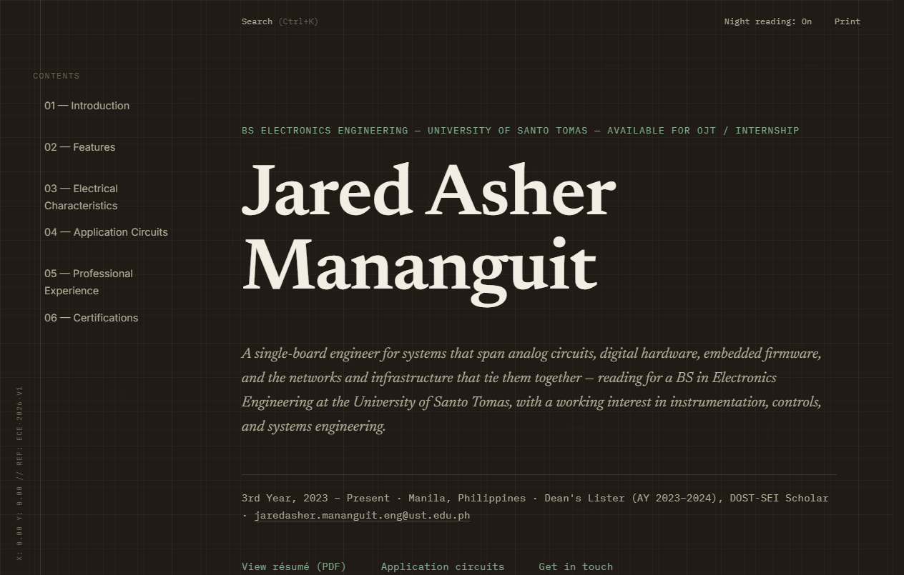

</td>
</tr>
<tr>
<td width="50%">

**Engineering Projects section**
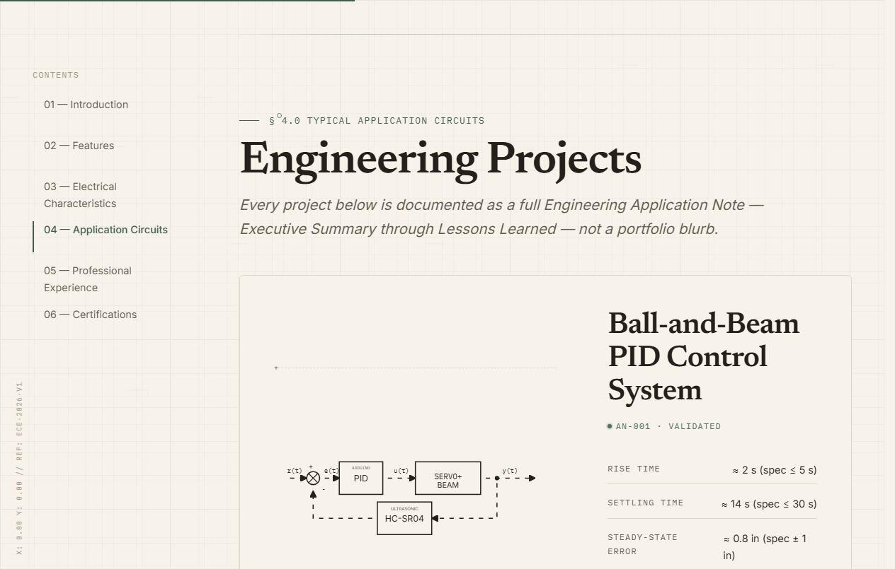

</td>
<td width="50%">

**Certifications**
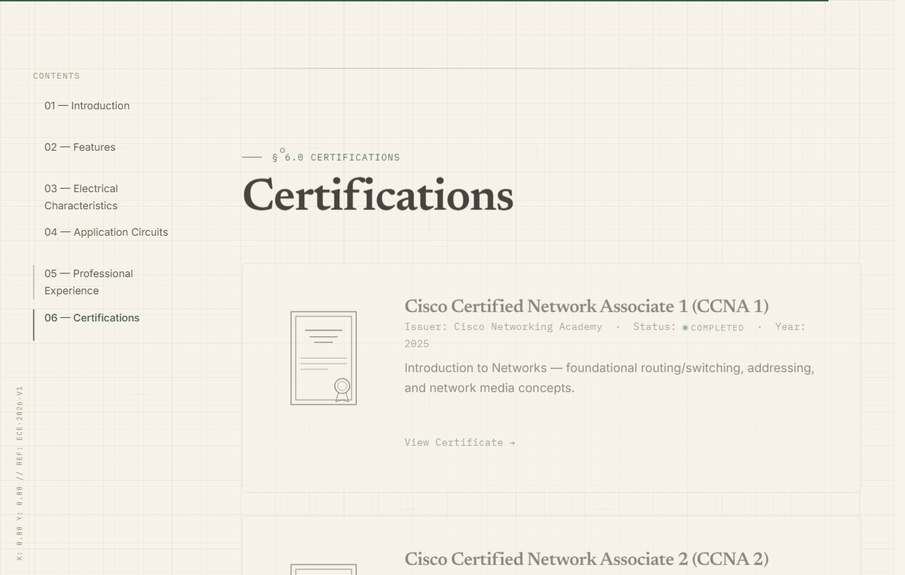

</td>
</tr>
<tr>
<td width="50%">

**Project detail page**
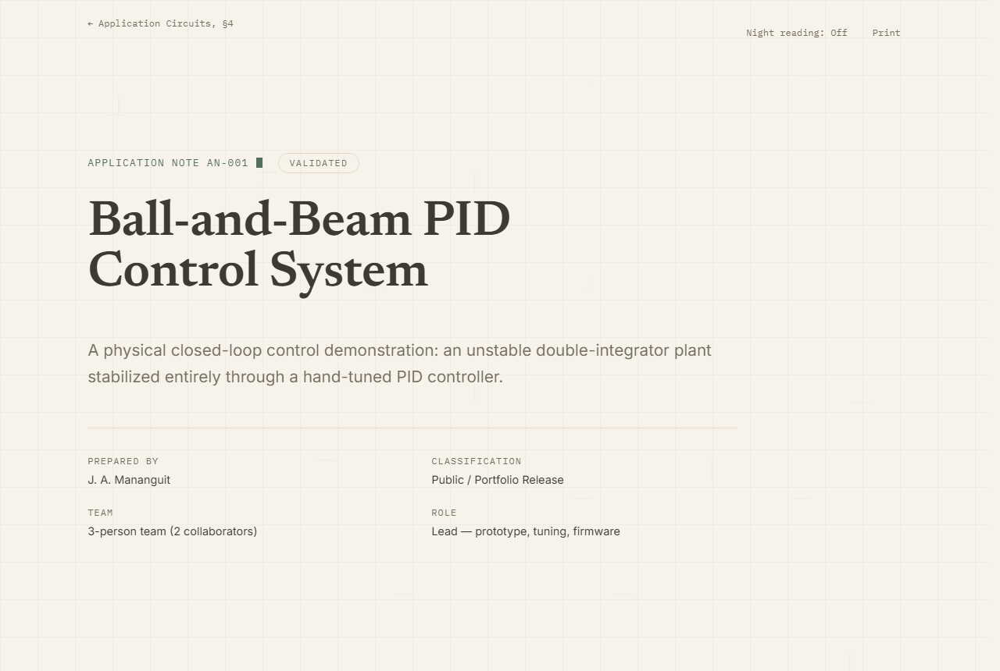

</td>
<td width="50%">

**Engineering illustration** (AN-004, SAP-2 CPU architecture)
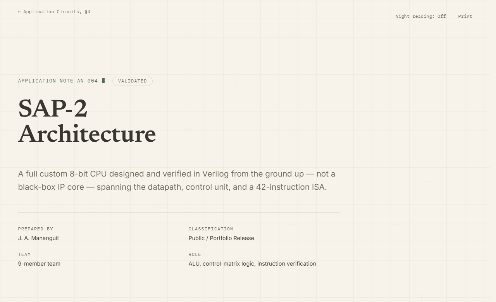

</td>
</tr>
</table>

### Mobile (iPhone 15 Pro, 393×852 @ 3x)

Captured against the actual current site — where a requested shot didn't match an existing section (no standalone "Featured Project" or "Contact" section yet, and "Experience" is a table rather than a visual timeline — see [Status](#status-this-is-v2-in-progress)), the closest real equivalent is shown and captioned accordingly rather than invented.

<table>
<tr>
<td width="33%">

**Hero**
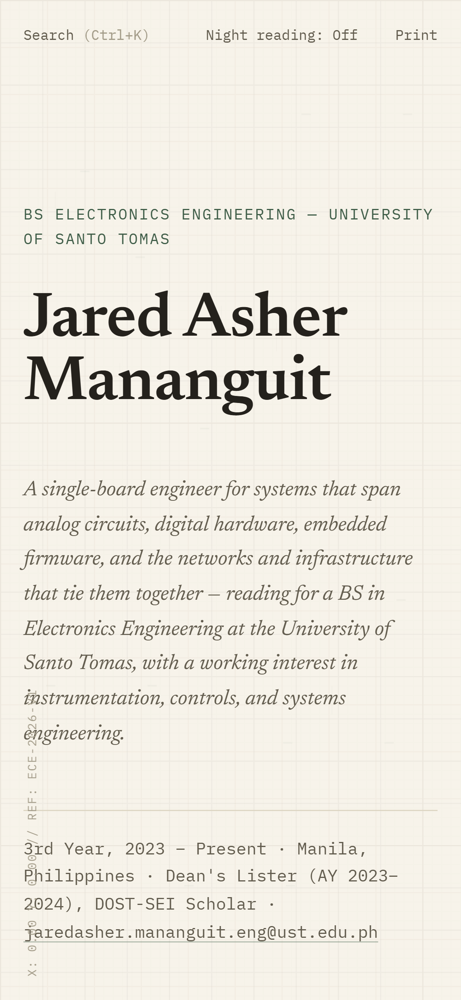

</td>
<td width="33%">

**Mobile navigation** (expanded)
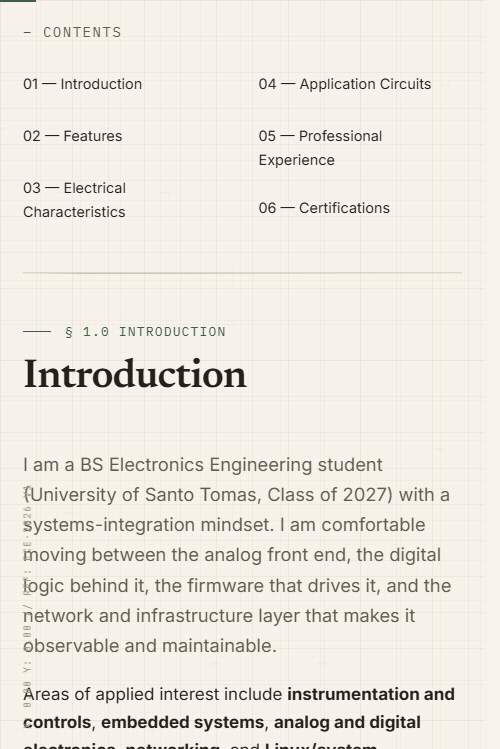

</td>
<td width="33%">

**Dark mode**
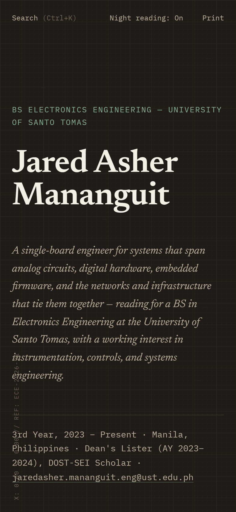

</td>
</tr>
<tr>
<td width="33%">

**Projects** (closest match for "Featured Project" — there isn't a single spotlighted project yet)
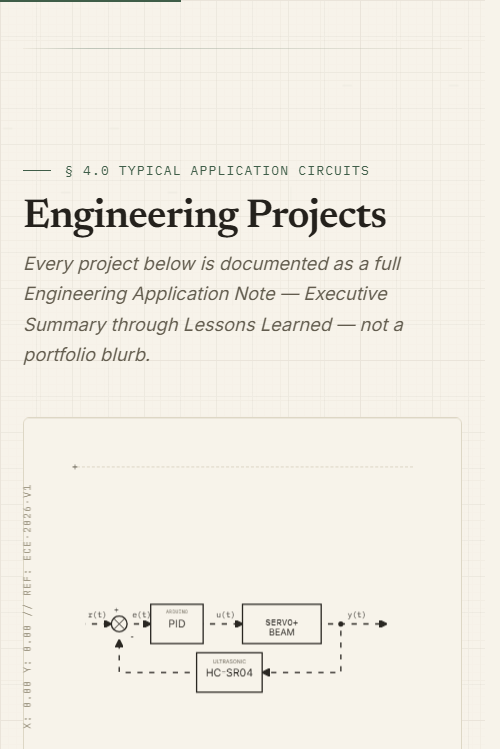

</td>
<td width="33%">

**Project case study**
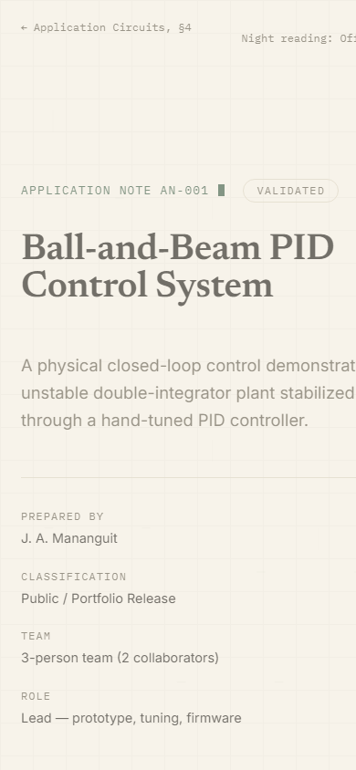

</td>
<td width="33%">

**Skills / Technologies** (the "Technical Competencies" section)
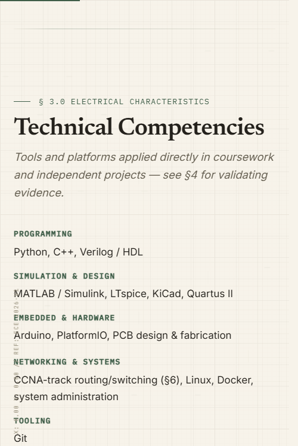

</td>
</tr>
<tr>
<td width="33%">

**Experience** (currently a table, not a visual timeline)
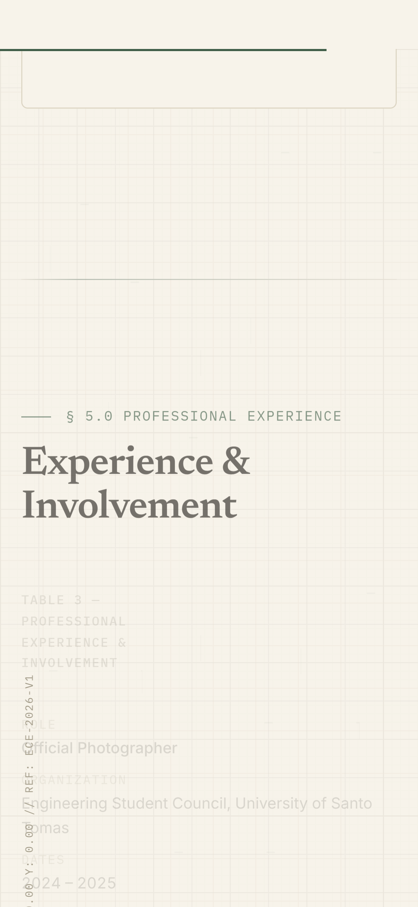

</td>
<td width="33%">

**Contact** (a link in the hero's action row — there's no standalone contact section yet)
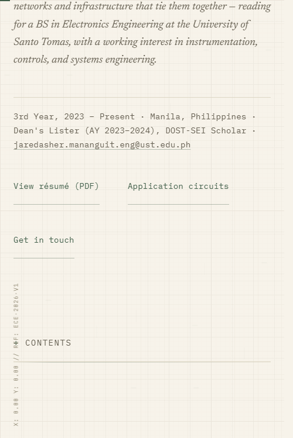

</td>
<td width="33%">

**Footer**
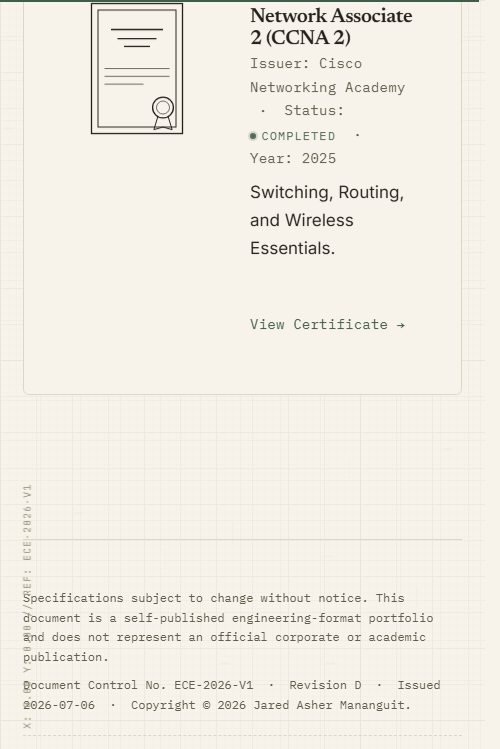

</td>
</tr>
</table>

## Responsive Design

The layout is built mobile-up from a single CSS breakpoint: above ~1080px, the bookmark rail sits alongside a wide reading column; below it, the rail is replaced by the collapsible `<details>` mobile table of contents shown above, and the reading column takes the full viewport width. Every other adjustment (hero type scale, section padding, card grids) uses fluid `clamp()` sizing rather than a series of fixed breakpoints — see [`docs/DESIGN_SYSTEM.md`](docs/DESIGN_SYSTEM.md#typography) for the exact scale.

| | Desktop | Mobile |
| :--- | :---: | :---: |
| **Hero** |  |  |
| **Project case study** |  |  |

This is verified, not just designed-and-assumed: [`tests/e2e/responsive.spec.ts`](tests/e2e/responsive.spec.ts) checks rail/ToC visibility at desktop, tablet, and mobile widths, confirms the mobile ToC actually opens on click, asserts zero horizontal overflow, and checks the hero name never overflows its container from 375px through 1600px — see [End-to-End Testing](#end-to-end-testing).

## Project Structure

```text
(repo root)
├── index.html              # Homepage
├── css/                     # tokens, base, layout, components, utilities, motion, print
├── js/                      # theme, nav, search, reveal, engineering-fx, main
├── projects/                # AN-00x Application Note case-study pages
├── assets/                  # fonts/, certificates/
├── Jared_Mananguit_Resume.pdf
├── scripts/                 # build.mjs, check-links.mjs
├── tests/e2e/               # Playwright end-to-end test suite
├── playwright.config.ts
├── docs/                    # extended documentation, screenshots
└── CV/                      # source material not published on the site
    ├── READ/ProjectCV.md    # original V1 design brief
    └── Resume/, Certificates/ # source copies of published PDFs

project_documents/           # raw coursework PDFs — content backlog for
                              # future Application Notes (see docs/ARCHITECTURE.md)
```

See [`docs/ARCHITECTURE.md`](docs/ARCHITECTURE.md) for what each directory is responsible for and why it's organized this way.

## Technologies

| Technology | Role |
| :--- | :--- |
| **Semantic HTML5** | Document structure and content — no JS framework mounts a virtual DOM over it. |
| **Modular CSS3** (ITCSS-inspired) | The entire visual design system: color/type/spacing tokens, then base, layout, components, utilities, motion, and print, layered by responsibility. |
| **Vanilla JavaScript** (ES modules) | Progressive enhancement only — search, theme toggle, scroll-spy nav, scroll reveal. Every script no-ops safely if its markup is absent. |
| **Newsreader + Inter + IBM Plex Mono** | Self-hosted `woff2` type system — serif display, sans body, mono for data/labels. |
| **Node.js + npm scripts** | Local dev server, linting, link-checking, build packaging — no bundler, because none is needed. |
| **htmlhint / stylelint** | Static analysis for HTML validity and real CSS defects (duplicate selectors, invalid rules). |
| **Playwright + axe-core** | End-to-end and automated accessibility testing — see [End-to-End Testing](#end-to-end-testing). |
| **GitHub Actions** | CI (lint, build, test) on every push/PR, plus automatic GitHub Pages deployment on `main`. |

## Design Philosophy

- **Engineering-publication aesthetic.** Every layout decision is checked against one question: *would this be believable inside official documentation from an IEEE journal or a semiconductor application note?*
- **Modular architecture.** CSS is layered by responsibility (`tokens` → `base` → `layout` → `components` → `utilities` → `motion` → `print`), so a color or spacing change is safe to make in one place instead of hunting through component files.
- **Responsive layout.** The bookmark-rail-plus-reading-column structure only makes sense above ~1080px; every breakpoint decision is driven by content legibility, not device categories.
- **Illustration system.** Diagrams are real DOM SVG, not images — see [Features](#features) above for why that matters technically. Full rationale in [`docs/DESIGN_SYSTEM.md`](docs/DESIGN_SYSTEM.md).
- **Typography.** *Newsreader* (serif) carries headings and standfirst copy with an editorial, literary register; *Inter* (sans) carries body copy for legibility at high information density; *IBM Plex Mono* is reserved for anything that reads as data.
- **Color system.** A warm ivory/graphite palette with a single muted forest-green accent, used sparingly — chosen deliberately over the more common "SaaS/dashboard" cool-gray-plus-bright-accent palette. Full palette values and rationale in [`docs/DESIGN_SYSTEM.md`](docs/DESIGN_SYSTEM.md).

## AI-Assisted Development

AI was used as an engineering assistant at two points in this project's history — architecture inspection, implementation planning, refactoring, and QA support, with every change reviewed, tested, and directed by the author. It was not used to autonomously generate the design or content.

See [`docs/PROMPT_ENGINEERING.md`](docs/PROMPT_ENGINEERING.md) for the detailed, structured-prompting workflow used, and [`CHANGELOG.md`](CHANGELOG.md) for the specific, dated record of what changed and why.

## Local Development

**Prerequisites:** Python 3 (simplest static server) or Node.js 18+ (for lint/test/dev/build scripts).

```bash
git clone https://github.com/Jrddlol2/jared-mananguit-engineering-portfolio-v2.git
cd jared-mananguit-engineering-portfolio-v2
npm install
```

```bash
# Option A — zero dependencies
python -m http.server 8080

# Option B — via npm scripts
npm run dev      # serves the site on http://localhost:3000
npm run lint     # HTML + CSS linting
npm run build    # assembles a deployable copy in dist/
```

> [!NOTE]
> **No environment variables required.** This is a static site with no backend.

## End-to-End Testing

### Why End-to-End Testing

The site has no server and no application logic to unit-test — its risk lives entirely in the browser: does the hero render, does search actually filter, does the theme toggle persist, does a certificate link resolve to a real PDF. End-to-end (E2E) testing exercises those things directly in a real browser instead of asserting them from the markup, which is what catches regressions that pure HTML/CSS linting cannot — see [Existing Test Coverage](#existing-test-coverage) below for concrete examples this suite has already caught.

**User journeys validated:** landing on the homepage and reading the hero, navigating via the bookmark rail and skip link, opening a project's Application Note page, using the command palette to jump to a section or project, toggling and persisting dark mode, following a certificate/résumé link through to a real file, and using the site on a phone-sized viewport.

### Testing Framework

- **[Playwright](https://playwright.dev/)** (`@playwright/test`), configured in [`playwright.config.ts`](playwright.config.ts).
- **Browsers actually configured:** two Playwright *projects*, both using the machine's real installed **Google Chrome** (`channel: 'chrome'`, not Playwright's bundled Chromium) — `chromium` (Desktop Chrome viewport) and `mobile-chrome` (Pixel 7 device emulation). Firefox and WebKit are not currently configured; see [Missing/Optional Follow-ups](#missing--optional-follow-ups-not-yet-implemented) below.
- **Why Chrome via `channel`, not Playwright's bundled browser:** it reuses an already-installed browser for local development instead of downloading a second one; CI installs the same channel explicitly (`npx playwright install --with-deps chrome`) so local and CI runs match.
- **Headless vs. headed:** tests run **headless** by default (`headless` is left unset in the config, which defaults to `true`). Run with `--headed` to watch them execute in a visible browser window — see [Running Tests](#running-tests).

### Test File Layout

```text
playwright.config.ts     # Playwright configuration (browsers, web server, reporters)
tests/e2e/                # every test file — no fixtures/ or utils/ directory yet, each spec is self-contained
├── navigation.spec.ts     # bookmark rail, skip link, back-links, full internal-link crawl
├── homepage.spec.ts        # title, hero content, all six sections, load-time smoke test
├── projects.spec.ts        # each of the 5 Application Note pages
├── certificates.spec.ts    # certificate + résumé links, including a real PDF fetch check
├── responsive.spec.ts      # desktop/tablet/mobile layout behavior
├── search.spec.ts          # the Ctrl+K command palette
├── theme.spec.ts           # dark mode toggle + persistence
└── accessibility.spec.ts   # axe-core scans + heading hierarchy + keyboard reachability
```

Generated, gitignored output (not committed): `test-results/` (per-test traces/screenshots on failure) and `playwright-report/` (the HTML report).

### Installation

```bash
npm install                              # installs @playwright/test and @axe-core/playwright
npx playwright install --with-deps chrome   # only needed if Google Chrome isn't already installed
```

### Running Tests

All of the following are real, currently-working commands in this repository:

```bash
npm test                          # link-check (scripts/check-links.mjs) + the full Playwright suite
npm run test:e2e                   # Playwright suite only, both browser projects

npx playwright test tests/e2e/search.spec.ts     # a single test file
npx playwright test --headed                      # headed (visible browser) mode
npx playwright test --debug                        # Playwright's step-through debug mode
npx playwright test --project=chromium              # a single browser project (chromium or mobile-chrome)

npm run test:e2e:ui                # Playwright's interactive UI mode (npx playwright test --ui)
npm run test:e2e:report            # opens the last HTML report (npx playwright show-report)
```

### Existing Test Coverage

Based on the actual spec files in `tests/e2e/` — 84 tests total across both browser projects:

- **Navigation** — every bookmark rail link scrolls its target section into view, the skip link is keyboard-reachable and actually moves focus (not just scrolls), project-page back-links return to the right homepage section, and every unique internal link across all 6 pages is crawled and fetched to confirm it doesn't 404.
- **Homepage** — correct page title, zero console errors, hero content (name/standfirst/byline/actions), presence of all six document sections, and a load-time smoke check.
- **Project pages** — each of the 5 Application Notes: correct title/heading, its SVG diagram renders with an accessible name, zero console errors.
- **Certificates & résumé** — both certificate links and the résumé link are checked for correct `target`/`rel`, *and* the linked PDF is actually fetched and asserted to return `200` with a PDF content type.
- **Responsive layouts** — bookmark rail vs. mobile table-of-contents visibility across desktop/tablet/mobile widths, the mobile ToC actually opens on click, no horizontal overflow, and the hero name never overflows from 375px to 1600px.
- **Search** — opening via `Ctrl+K` and via the trigger button, live filtering, the empty-results state, `Enter`-to-navigate, `Escape`-to-close with focus restoration, and backdrop-click-to-close.
- **Theme** — respecting the OS `prefers-color-scheme` on first visit, the toggle flipping both the `data-theme` attribute and its visible label, and persistence across a reload and across navigating to a project page.
- **Accessibility** — automated `@axe-core/playwright` scans of the homepage and a project page (failing on `serious`/`critical` violations), every diagram having an accessible name, correct heading hierarchy, and keyboard reachability of the skip link and utility-bar controls.

This list intentionally does not include a few items from common E2E checklists that this suite does not cover yet — see below.

### Adding New Tests

- New spec files go in `tests/e2e/`, named `<area>.spec.ts` to match the existing convention (`navigation.spec.ts`, `theme.spec.ts`, etc.) — Playwright picks up anything matching `*.spec.ts` under `testDir` automatically, no registration needed.
- Keep one `test.describe` block per feature area, with individual `test()`s for each specific behavior — that's the pattern every existing file follows.
- Prefer asserting on real user-visible outcomes (text content, attribute values, visibility, a fetched resource's status code) over implementation details, so tests stay valid across visual redesigns.
- If a new project page is added, `navigation.spec.ts`'s internal-link crawl and `projects.spec.ts`'s per-project loop both need a new entry — they intentionally hardcode the current 5 pages so an omission is caught rather than silently skipped.
- Run `npm run test:e2e` locally before committing; see [`docs/TESTING.md`](docs/TESTING.md) for debugging tips and the specific reasoning behind this suite's configuration choices (why `python -m http.server` instead of `serve`, why `workers` is capped, etc.).

### Continuous Integration

Yes — [`.github/workflows/ci.yml`](.github/workflows/ci.yml) runs on every push and pull request to `main`. It installs dependencies and Playwright's Chrome, then runs `npm run lint`, `npm run build`, and `npm run test` (link-check + the full Playwright suite) in that order. The HTML test report is uploaded as a workflow artifact on every run (`if: always()`), so a failure's report is downloadable even though the job itself failed. A failing step turns the workflow red on the commit/PR; there is no separate "flaky test auto-retry in CI beyond what's configured" — see `retries` in `playwright.config.ts` for the one automatic retry that already applies to both local and CI runs.

### Missing / Optional Follow-ups (not yet implemented)

In the interest of not overstating coverage: this suite does not currently include cross-browser testing beyond Chrome (no Firefox/WebKit projects), a dedicated performance budget beyond the one load-time smoke assertion, or visual regression (screenshot-diff) testing. None of these are configured today — if any of them would be valuable, they'd need to be added deliberately rather than assumed to exist.

## Deployment

The site is a static build with no server-side dependency, so it deploys the same way to any static host. Two are set up:

### GitHub Pages (automatic)

Pushes to `main` automatically build and deploy via [`.github/workflows/deploy.yml`](.github/workflows/deploy.yml) — no action needed beyond pushing.

### Vercel

[`vercel.json`](vercel.json) configures the project:

```json
{
  "buildCommand": "npm run build",
  "outputDirectory": "dist",
  "cleanUrls": false
}
```

`outputDirectory: "dist"` matters here specifically: the repo root also contains `project_documents/`, `docs/`, `CV/`, and `tests/`, none of which are meant to be public. Pointing Vercel at the `npm run build` output (the same `dist/` folder GitHub Pages deploys) ensures only the intended files are served, rather than Vercel serving the raw repo root as-is. `cleanUrls: false` is explicit rather than left to Vercel's default for the same reason it mattered during local testing (see [`docs/TESTING.md`](docs/TESTING.md)): the site's internal links use literal `.html` extensions, and clean-URL rewriting would break them.

**To deploy:**

```bash
npm install -g vercel   # if you don't already have the CLI
vercel                   # first run: links the project, deploys a preview
vercel --prod            # promotes to the production URL
```

Or connect the GitHub repository directly from the [Vercel dashboard](https://vercel.com/new) — it will detect `vercel.json` automatically. No environment variables are required either way.

**Live URL:** not yet deployed — this section will be updated with the production URL once available.

See [`docs/DEPLOYMENT.md`](docs/DEPLOYMENT.md) for how the GitHub Pages workflow works, manual deployment steps for either host, and troubleshooting.

## Future Improvements

- Redesign the remaining sections (Features, Characteristics, Projects grid, Experience, Certifications) to match the new editorial hero.
- Content backlog: several raw coursework reports in `project_documents/` aren't yet written up as Application Notes, including a Multi-Agent Reinforcement Learning thesis manuscript — a strong candidate for a future "Featured Project."
- Interactive diagrams — hover states on SVG nodes revealing detailed tooltips.
- Automated résumé PDF generation from the live HTML, so the two can't drift out of sync.

## Author

**Jared Asher Mananguit** — BS Electronics Engineering (ECE), University of Santo Tomas
[jaredasher.mananguit.eng@ust.edu.ph](mailto:jaredasher.mananguit.eng@ust.edu.ph) · [GitHub @Jrddlol2](https://github.com/Jrddlol2)

## License

The code (HTML/CSS/JS) is licensed under [MIT](LICENSE). Personal content — résumé, certificates, project write-ups, and biographical text — is not covered by this license and should not be reused without permission.
