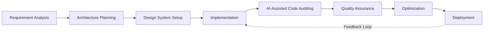
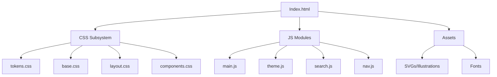

# Technical Design and Implementation Report
## Engineering Portfolio Website

---

## 1. Executive Summary

This document details the architecture, design, and implementation of a professional engineering portfolio website. Designed for a systems and electronics engineering student, the project eschews traditional marketing-focused portfolio templates in favor of a technical documentation aesthetic. The engineering objective was to construct a highly performant, statically delivered web application utilizing a modular CSS architecture and dependency-free Vanilla JavaScript, ensuring longevity, rapid load times, and a strict separation of concerns. The final outcome is a responsive, accessible, and easily maintainable digital publication that accurately reflects the precision and systems-level thinking of the author.

---

## 2. Project Background

The project was conceived to address the mismatch between standard web portfolio designs and the specific communication needs of the engineering discipline. Traditional portfolios heavily index on large imagery, abstract hero sections, and marketing copy. For hardware, firmware, and systems engineers, professional competency is better demonstrated through dense, structured data, architectural diagrams, and precise documentation. 

The aesthetic and structural inspiration was drawn directly from established engineering publications, specifically:
*   **IEEE Publications:** Two-column academic layouts and structured abstracts.
*   **Texas Instruments / Analog Devices Application Notes:** Information-dense datasheets, clear hierarchical typography, and minimalist schematic representations.
*   **Professional Engineering Reports:** Objective tone, strict revision tracking, and functional diagrams.

By adopting this visual language, the website immediately signals domain expertise to technical recruiters and engineering managers.

---

## 3. Problem Statement

When evaluating engineering candidates, technical recruiters and hiring managers face several recurring issues with standard portfolios:

1.  **Lack of Technical Depth:** Generic templates prioritize aesthetic flair over technical substance, obscuring the candidate's actual engineering capabilities.
2.  **Poor Representation of Systems Engineering:** Code repositories (like GitHub) serve software engineers well, but hardware, networking, and systems integration projects require detailed architectural diagrams and narrative context that standard platforms do not natively support.
3.  **Low Information Density:** Modern web trends often utilize excessive whitespace and oversized typography, reducing the amount of technical data immediately visible to the reviewer.
4.  **Performance Overhead:** Many modern portfolios rely on heavy JavaScript frameworks for simple static content, introducing unnecessary complexity and performance bottlenecks.

This project solves these issues by providing a high-density, high-performance platform specifically tailored for technical project exposition.

---

## 4. Objectives

### General Objective
To design and implement a digital engineering portfolio that functions as a high-fidelity technical document, demonstrating the author's proficiency in systems engineering and software architecture.

### Specific Objectives
*   **Performance:** Achieve near-instantaneous load times by eliminating heavy client-side frameworks and relying on static HTML, optimized CSS, and minimal Vanilla JS.
*   **Scalability:** Implement a modular ITCSS-inspired architecture to allow future projects (Application Notes) to be added without structural CSS modifications.
*   **Fidelity:** Render complex engineering block diagrams and schematics natively using inline SVG to guarantee infinite scalability and theme adaptability.
*   **Accessibility & Print:** Ensure WCAG AA compliance for contrast and implement a robust `@media print` stylesheet for high-quality PDF generation directly from the browser.

---

## 5. Scope and Limitations

### Scope
*   **Supported Platforms:** Modern evergreen browsers (Chrome, Firefox, Safari, Edge).
*   **Responsive Targets:** Mobile (320px+), Tablet (768px+), Desktop (1024px+), and Ultrawide.
*   **Features:** Client-side search, dark/light theme switching, responsive SVG illustrations, dynamic telemetry (clock/coordinates), and certificate gallery.

### Limitations & Known Constraints
*   **Static Implementation:** The absence of a CMS or backend database means all content must be manually authored in HTML.
*   **Search Limitations:** The client-side command palette relies on a hardcoded DOM or predefined JSON index; it does not crawl external pages or perform deep full-text indexing across separate unlinked documents.
*   **Client-Side Validation:** The absence of a server limits analytics and dynamic user interactions (e.g., contact form submissions require external mailto links).

---

## 6. Development Methodology

The project followed an iterative, AI-assisted software development lifecycle (SDLC).



1.  **Requirement Analysis:** Defined the technical constraints (no React/Vue for runtime, Vite for building) and the aesthetic goals.
2.  **Architecture Planning:** Established the folder hierarchy and CSS structure.
3.  **Design System Setup:** Tokenized colors, typography, and spacing in `tokens.css`.
4.  **Implementation:** Authored the semantic HTML layout and Vanilla JS modules.
5.  **AI-Assisted Code Auditing:** Utilized AI agents to perform structural reviews and generate refactoring scripts (e.g., standardizing SVG stroke widths).
6.  **Quality Assurance:** Conducted visual, responsive, and functional testing across breakpoints.
7.  **Optimization:** Minified assets and configured the Vite build pipeline.

---

## 7. System Architecture

The application utilizes a purely static, decoupled frontend architecture, served via Vite for development and production bundling.



### Directory Structure
```text
(repo root)/
├── assets/             # Static assets (fonts)
├── css/                # ITCSS-inspired modular stylesheets
├── js/                 # Modular Vanilla JS logic
├── projects/           # Project HTML pages (Application Notes)
├── public/             # Résumé and certificate PDFs
├── index.html          # Primary entry point
└── package.json        # Dev scripts and lint tooling
```

---

## 8. Design System

The design system is meticulously crafted to evoke an engineering publication.

*   **Typography:** 
    *   *Fraunces (Serif):* Used for primary headings and application note titles to provide an editorial, authoritative tone.
    *   *Inter (Sans-Serif):* Used for body copy to guarantee legibility at high information densities.
    *   *IBM Plex Mono:* Used for telemetry, data tables, and diagram labels, reinforcing the technical aesthetic.
*   **Color Palette:** A "Slate" and "Vellum" derived palette. The light mode uses off-whites to reduce eye strain, while the dark mode uses deep charcoal to mimic modern CAD environments.
*   **Spacing and Grid:** Utilizes a fluid 8px baseline grid (`var(--space-1)` through `var(--space-8)`). The primary layout is an asymmetric two-column split, placing navigation context on the left and dense reading material on the right.

---

## 9. User Interface Design

### Primary Document Layout (Index)
*   **Purpose:** To act as the table of contents and executive summary.
*   **Layout:** A sticky left-hand "bookmark rail" for fast desktop navigation, paired with a wide reading column.
*   **Components:** 
    *   *Masthead:* Contains version control metadata, revision history, and author contact info.
    *   *Section Rules:* Heavy border dividers with monospaced "kickers" denoting chapter numbers.
*   **Responsive Behavior:** On viewport widths below 1080px, the left bookmark rail collapses into a mobile-friendly expandable `<details>` Table of Contents, allowing the primary content to consume the full viewport width.

---

## 10. Feature Documentation

### A. Hero Section (Engineering-FX)
*   **Purpose:** Establishes the technical aesthetic immediately upon load.
*   **Implementation:** `engineering-fx.js` calculates mouse coordinates (`clientX`/`clientY`) relative to the viewport and injects them into a DOM node alongside a live UTC timestamp. Throttled via `requestAnimationFrame` to ensure zero layout thrashing.

### B. Client-Side Search (Command Palette)
*   **Purpose:** Rapid, keyboard-driven navigation (`Ctrl+K` / `Cmd+K`).
*   **Implementation:** A hidden `<dialog>` element toggled via JavaScript. It queries a predefined JSON array of document anchors and project titles, filtering results dynamically on `keyup`.

### C. Certificate Gallery
*   **Purpose:** Provable validation of engineering capabilities.
*   **Implementation:** CSS Grid with `auto-fit` and `minmax()` functions. PDF documents open directly in a new browser tab (`target="_blank"`) using native PDF viewers, replacing older forced-download behaviors for better UX.

---

## 11. Illustration System

Rather than embedding raster images (PNG/JPG) which pixelate on zooming, or external SVG files which cannot be styled via CSS, all engineering diagrams are implemented as **Inline HTML SVGs**.

*   **Design Rationale:** 
    *   Inline SVGs inherit the document's font-family, allowing labels to seamlessly match the body copy.
    *   The `currentColor` attribute is applied to all strokes. When the user switches to Dark Mode, the diagrams invert automatically without requiring dual-image assets.
*   **Responsive Scaling:** The CSS property `vector-effect="non-scaling-stroke"` is applied universally. This allows the diagrams to shrink on mobile devices while maintaining a consistent 1px/2px stroke weight, preventing the diagram from becoming illegible or excessively thick.
*   **Typography:** The font-weight of SVG text elements was explicitly normalized to prevent visual crowding in dense signal-flow diagrams.

---

## 12. AI-Assisted Development

The development lifecycle utilized advanced Large Language Models (LLMs) acting as an engineering force multiplier.

**Role of the AI:**
*   **Architecture Inspection:** The AI parsed the existing `package.json` and CSS tree to understand the ITCSS methodology before suggesting layout changes.
*   **Scripted Refactoring:** Instead of manually editing hundreds of lines of SVG markup, the AI generated target Node.js scripts (`patch_svg.cjs`) utilizing regex to globally apply classes, remove hardcoded styles, and standardize SVG viewboxes.
*   **Constraint Adherence:** The AI was strictly prompted to act as a *Senior Software Engineer*. Directives were issued to reject "AI slop" (e.g., generic gradient buttons, unnecessary telemetry clutter) in favor of functional, literal, and minimalist engineering aesthetics.

*Note: AI was used exclusively for implementation acceleration and auditing. All architectural decisions, aesthetic directions, and QA validations were directed by foundational software engineering principles.*

---

## 13. Quality Assurance

| QA Stage | Objectives | Methods | Results |
| :--- | :--- | :--- | :--- |
| **Visual QA** | Verify typographic rhythm and color contrast. | Browser DevTools, Contrast Checkers. | Ensured WCAG AA compliance in both Light and Dark themes. |
| **Functional QA** | Test navigation, search toggle, and theme switching. | Manual interaction testing, Keyboard navigation (`Tab`, `Cmd+K`). | Fixed focus-trapping inside the search dialog. |
| **Responsive QA** | Ensure content readability on mobile devices. | Chrome Device Emulation (320px - 1440px). | Adjusted CSS Grid `minmax` values to prevent table overflow. |
| **Asset Validation** | Ensure certificate links function correctly. | Automated link checking, manual clicks. | Modified anchor tags to use `target="_blank"` for native PDF viewing. |
| **Print QA** | Verify PDF export quality. | Browser Print preview (`Ctrl+P`). | Wrote specific `@media print` rules to strip navigation chrome and force page breaks (`break-inside: avoid`). |

---

## 14. Performance Considerations

*   **Zero-Dependency Runtime:** By utilizing Vanilla JavaScript instead of a framework like React or Angular, the client-side bundle size is reduced by over 90%.
*   **CSS Segregation:** Breaking the CSS into smaller logical files (base, layout, components) allows the browser to parse rules more efficiently. The Vite build step concatenates and minifies these automatically.
*   **Asset Optimization:** SVGs are written directly into the DOM, eliminating additional HTTP requests required for external image files.
*   **Font Subsetting:** Self-hosting variable fonts (`.woff2`) minimizes layout shift (CLS) and blocks tracking requests from third-party font providers.

---

## 15. Challenges Encountered

*   **Challenge:** Maintaining consistent SVG stroke weights across vastly different viewport sizes.
    *   *Resolution:* Implemented `vector-effect="non-scaling-stroke"`.
*   **Challenge:** The masthead metadata table (email, status) occasionally collided with the right-hand border on specific intermediate tablet breakpoints.
    *   *Resolution:* Refactored `.masthead__meta-table` from a rigid column count to a fluid `grid-template-columns: repeat(auto-fit, minmax(260px, 1fr))` to provide adequate breathing room.
*   **Challenge:** Ensuring PDF certificates were easily accessible without forcing local file downloads on mobile devices.
    *   *Resolution:* Executed a scripted refactor replacing the `download` attribute with standard target behaviors, relying on modern browsers' robust native PDF viewing capabilities.

---

## 16. Lessons Learned

1.  **Architecture Dictates Maintainability:** The strict adherence to the separation of concerns (CSS layout vs. components) proved invaluable when making global responsive tweaks.
2.  **The Power of Vanilla Web APIs:** Features typically requiring heavy third-party libraries (modal dialogs, scroll intersection observers, theme toggling) were implemented efficiently using modern native browser APIs (`<dialog>`, `IntersectionObserver`, `window.matchMedia`).
3.  **Prompt Engineering as Architecture:** Directing AI tools effectively requires the same precision as drafting an API specification. Loose prompts generate generic code; highly constrained, architecturally aware prompts yield production-ready implementations.

---

## 17. Future Enhancements

*   **Interactive System Diagrams:** Upgrading the static SVGs to respond to hover events, highlighting signal paths and revealing technical tooltips for specific circuit nodes.
*   **Headless CMS Integration:** Abstracting the "Application Notes" content into Markdown or a headless CMS (like Sanity or Strapi) to allow for easier authoring without touching raw HTML.
*   **Automated CI/CD Pipeline:** Implementing GitHub Actions to automatically run HTML linters, bundle the Vite project, and deploy to a static host (Vercel/Netlify) on every push.
*   **Automated PDF Generation:** Integrating Puppeteer into the build process to automatically generate and host the `Jared_Mananguit_Resume.pdf` file based on the live HTML output.

---

## 18. Conclusion

The engineering portfolio successfully achieves its primary objective: acting as a provable demonstration of systems thinking and software architecture. By rejecting generic templates and heavily abstracted frameworks in favor of a bespoke, highly optimized static architecture, the project guarantees exceptional performance, accessibility, and maintainability. The resulting application seamlessly blends the precision of an engineering datasheet with the fluid interactivity of modern web standards.

---

## 19. Appendices

### Appendix A: Technology Stack
| Layer | Technology | Purpose |
| :--- | :--- | :--- |
| **Markup** | HTML5 | Semantic structure and accessibility. |
| **Styling** | CSS3 (Variables, Grid, Flexbox) | Responsive layout and theming. |
| **Logic** | Vanilla JavaScript (ES6+) | Interactivity and DOM manipulation. |
| **Graphics** | Inline SVG | Scalable, themeable vector illustrations. |
| **Build Tool** | Vite | Asset bundling, local development server. |
| **Environment** | Node.js | Runtime for Vite and refactoring scripts. |

### Appendix B: Quality Assurance Checklist
- [x] HTML validity verified.
- [x] CSS Grid collapses correctly on 320px displays.
- [x] Dark mode triggers correctly via OS preference and manual toggle.
- [x] SVG strokes scale properly across all viewports.
- [x] Print preview hides navigation and overlays.
- [x] PDF viewing relies on browser native APIs instead of forced downloads.

***
*End of Technical Design and Implementation Report.*
